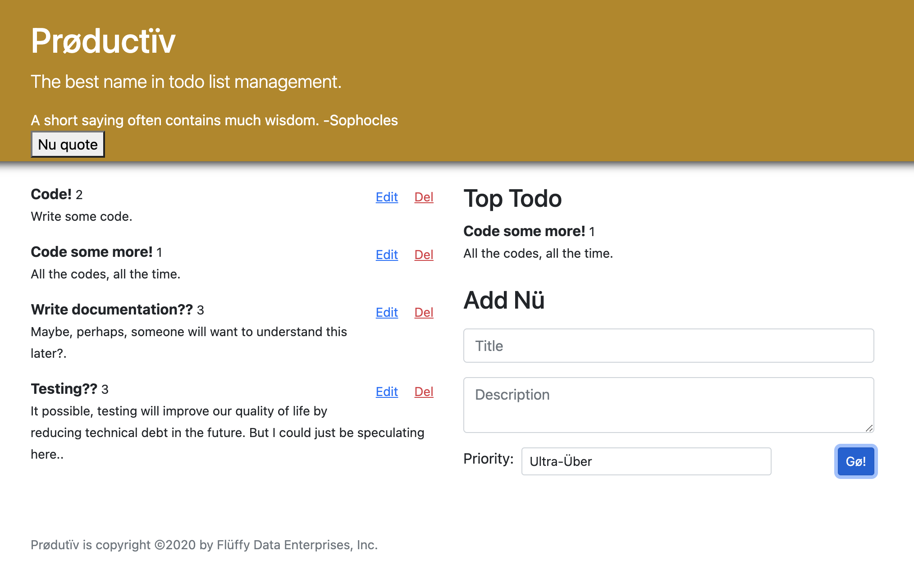

<div id="top"></div>
<!--
*** Thanks for checking out the Best-README-Template. If you have a suggestion
*** that would make this better, please fork the repo and create a pull request
*** or simply open an issue with the tag "enhancement".
*** Don't forget to give the project a star!
*** Thanks again! Now go create something AMAZING! :D
-->


<!-- PROJECT SHIELDS -->
<!--
*** I'm using markdown "reference style" links for readability.
*** Reference links are enclosed in brackets [ ] instead of parentheses ( ).
*** See the bottom of this document for the declaration of the reference variables
*** for contributors-url, forks-url, etc. This is an optional, concise syntax you may use.
*** https://www.markdownguide.org/basic-syntax/#reference-style-links
-->
[![LinkedIn][linkedin-shield]][linkedin-url]


<h1 align="center">Prøductïv</h1>

  <p align="center">
    Prøductïv is a scandinavian themed todo application with a nifty little quote generator, and priority settings.
    <br />
    <a href="https://github.com/calebthewood/express-jobly/issues">Request Feature</a>
  </p>
</div>




<hr>


<!-- TABLE OF CONTENTS -->
<details>
  <summary>Table of Contents</summary>
  <ol>
    <li>
      <a href="#about-the-project">About The Project</a>
      <ul>
        <li><a href="#built-with">Built With</a></li>
      </ul>
    </li>
    <li>
      <a href="#getting-started">Getting Started</a>
      <ul>
        <li><a href="#prerequisites">Prerequisites</a></li>
        <li><a href="#installation">Installation</a></li>
      </ul>
    </li>
    <li><a href="#usage">Usage</a></li>
    <li><a href="#roadmap">Roadmap</a></li>
    <li><a href="#contributing">Contributing</a></li>
    <li><a href="#license">License</a></li>
    <li><a href="#contact">Contact</a></li>
    <li><a href="#acknowledgments">Acknowledgments</a></li>
  </ol>
</details>


<!-- ABOUT THE PROJECT -->
## About The Project


### Built With

* [ReactJS](https://reactjs.org/)
* [React-DOM](https://reactjs.org/docs/react-dom.html)
* [React Testing Library](https://testing-library.com/docs/react-testing-library/intro/)
* [AXIOS](#)


<p align="right">(<a href="#top">back to top</a>)</p>


<!-- GETTING STARTED -->
## Getting Started

This is a front-end application. State is maintained by react as you interact with the application, but a refresh will revert all todos back to the default state.


### Installation


1. Clone the repo
   ```sh
   git clone https://github.com/calebthewood/react-productiv
   ```
2. Install NPM packages
   ```sh
   npm install
   ```
3.  Run in Development mode
    ```sh
    npm start
    ```
4. Run React Test Library Tests
    ```
    npm test
    ```

<p align="right">(<a href="#top">back to top</a>)</p>


<!-- ROADMAP -->
## Roadmap

- [ ] Connect postgres DB to persist data
- [ ] Improve 'nu quote' button
- [ ] Update fake copyright
- [ ] Update edit/delete buttons

See the [open issues](https://github.com/calebthewood/react-productiv/issues) for a full list of proposed features (and known issues).

<p align="right">(<a href="#top">back to top</a>)</p>


<!-- CONTRIBUTING -->
## Contributing

If you have a suggestion that would make this better, please fork the repo and create a pull request. You can also simply open an issue with the tag "enhancement".
Don't forget to give the project a star! Thanks again!

1. Fork the Project
2. Create your Feature Branch (`git checkout -b feature/AmazingFeature`)
3. Commit your Changes (`git commit -m 'Add some AmazingFeature'`)
4. Push to the Branch (`git push origin feature/AmazingFeature`)
5. Open a Pull Request

<p align="right">(<a href="#top">back to top</a>)</p>


<!-- CONTACT -->
## Contact

Questions? - I'm on twitter [@calebthewood](https://twitter.com/calebthewood) - or email: calebwood.cs@gmail.com

Check out my [personal site!](https://www.calebwood.dev/)


<!-- ACKNOWLEDGMENTS -->
## Acknowledgments

* [Rithm School](https://www.rithmschool.com/)

<p align="right">(<a href="#top">back to top</a>)</p>


<!-- MARKDOWN LINKS & IMAGES -->
<!-- https://www.markdownguide.org/basic-syntax/#reference-style-links -->
[contributors-shield]: https://img.shields.io/github/contributors/calebthewood/react-productiv.svg?style=for-the-badge
[contributors-url]: https://github.com/calebthewood/react-productiv/graphs/contributors

[issues-shield]: https://img.shields.io/github/issues/calebthewood/react-productiv.svg?style=for-the-badge
[issues-url]: https://github.com/calebthewood/react-productiv/issues
[linkedin-shield]: https://img.shields.io/badge/-LinkedIn-black.svg?style=for-the-badge&logo=linkedin&colorB=555
[linkedin-url]: https://linkedin.com/in/caleb-wood-440b37168